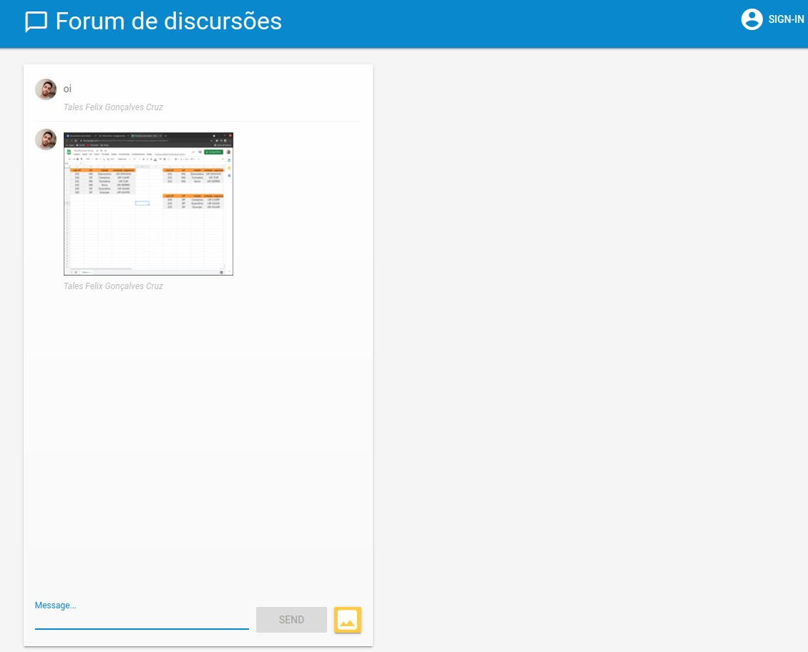

  <h1 align="center" >      
     Forum em tempo real com Firebase </h1> 
  
  
Print Aplicação

 

  
<h1>💻 Visualize</h1>

Visualize está aplicação em https://mensagens-4c017.web.app/

 

<h1>🚀 Tecnologias</h1>
 

Esse projeto é um estudo de API usando as seguintes tecnologias:

- ✔️ HTML  
- ✔️ CSS  
- ✔️ JavaScript  
- ✔️ Firebase CLI  

# Firebase Web Codelab - Start code

This folder contains the starting code for the [Firebase: Build a Real Time Web Chat App Codelab](https://codelabs.developers.google.com/codelabs/firebase-web/).

If you'd like to jump directly to the end and see the finished code head to the [web](../web) directory.
